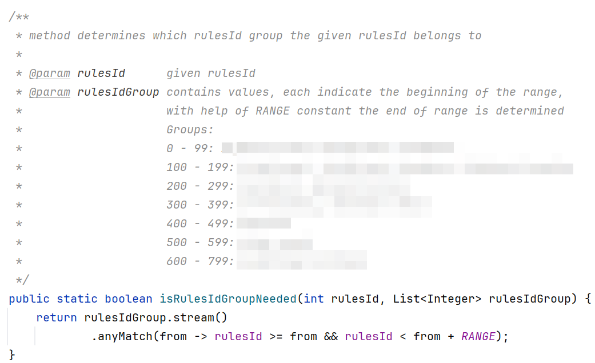

Мой пример не совсем в тему. Он скорее про то, что нужно объединять свойства поддомена в один класс для более простого оперирования неймингом полей и бизнес-логикой. Постфактум вспомнил яркий пример в нашем коде:

На этапе ревью у меня не было идей, как сделать работу с этими диапазонами изящнее. Сейчас понятно, что под каждый диапазон нужен отдельный класс, который будет содержать специфичную бизнес-логику.