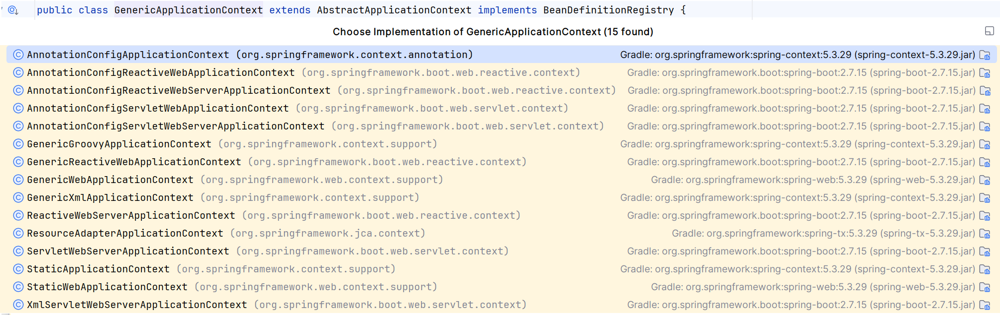

Мой пример с наследованием реализации кажется удачным, а вот пример льготного наследования не совсем. В этом случае в эталонном решении лучше отражена идея, что потомок отражает конкретный частный случай. Лучше было бы, привести пример, например с контекстами приложения в Spring, где каждый потомок -- частный случай базового контекста:

