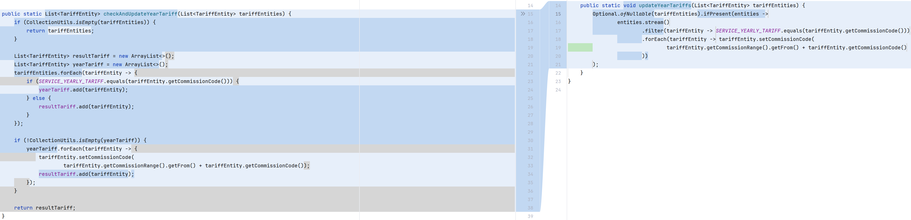
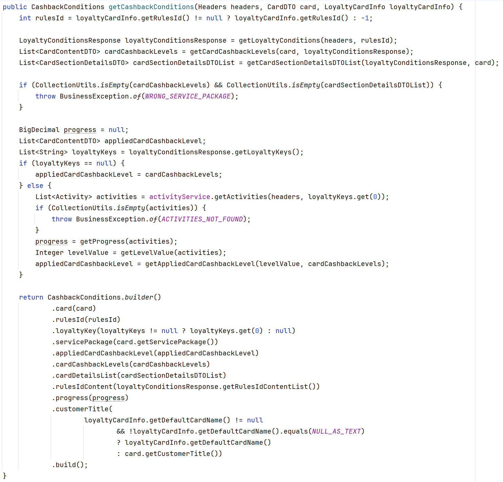
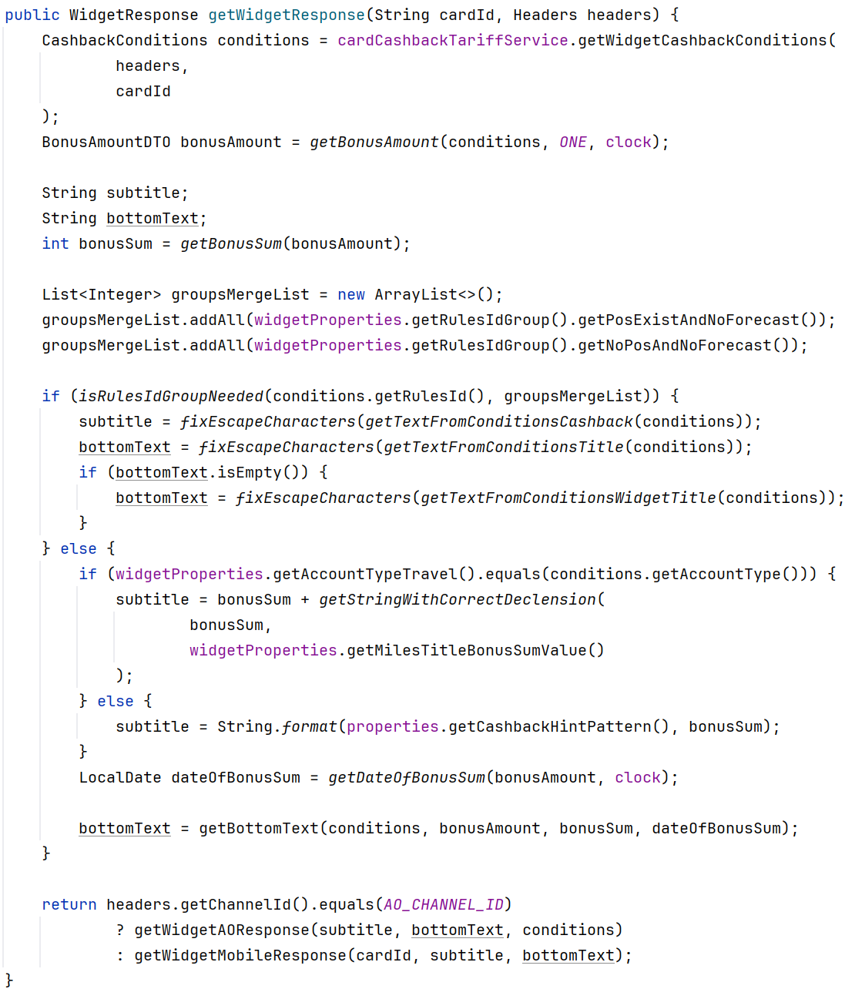

# Ghost State

### Пример 1

Исходный метод предполагает введение нескольких локальных переменных (resultTariff и yearTariff), которые усложняют понимание кода. Для упрощения перейдем к функциональному стилю. Я попутно изменил сигнатуру метода, потому что исходный метод по своей идее не подразумевает возвращаемого значения (модифицирует входные значения). Если возвращаемое значение оставить, то смысл не меняется: можем так же от локальных переменных избавиться. 



На Kotlin модификация исходного метода выглядела бы более "правильно": иммутабельность, более элегантный синтаксис по сравнению с optional, гарантированно возвращаем NonNullable-значение.

```kotlin
    fun List<TariffEntity>?.withUpdateYearTariff(): List<TariffEntity> {
        return this?.map { tariffEntity ->
            if (tariffEntity.commissionCode == SERVICE_YEARLY_TARIFF) {
                tariffEntity.copy(commissionCode = tariffEntity.commissionRange.from + tariffEntity.commissionCode)
            } else {
                tariffEntity
            }
        } ?: emptyList()
    }
```

### Пример 2

Нашел такой метод в сервисе коллеги:



Уже на втором примере готов сформировать свой вывод. Обилие локальных переменных, множество ветвлений, перегруженность логикой делают метод абсолютно неподдерживаемым. Даже наличие хотя бы одного из пунктов выше говорят о низком качестве кода, но беда не приходит одна и мы видим, что каждый из пунктов вытекает и одновременно является следствием другого. Такой код очень хрупок и требует значительных усилий для поддержки.

Если говорить только о локальных переменных, то часто от них можно избавиться достаточно просто: привести код к функциональному стилю. Однако если метод в императивном стиле сходу не поддается такой трансформации, то скорее всего можно говорить о том, что надо подумать над более глубоким рефакторингом.


### Пример 3

И еще один пример метода:



Здесь настораживает наличие локальных переменных, которым идет присваивание происходит не единожды (subtitle и bottomText).
Рефакторинг или доработку такого "ветвистого" метода сделать непросто, так как код уж больно хрупкий.

# Imprecision

Не до конца уверен, что точно уловил идею, но попробую предложить свои примеры.

### Пример 1

В этом примере предполагается сложение двух денежных сумм:

```java
public double sum(double amount1, double amount2) {
    return amount1 + amount2;
}
```

В Java тип данных double используется для представления чисел с плавающей точкой. Однако, из-за его способа представления в памяти, он не может использоваться в точных вычислениях, таких как, например, баланс банковского счета.

Кажется, что в таком случае для сумм требуется другое представление, например, мы используем:

```
public class AmountDto {
    private Long value;
    private String currency;
    private Integer minorUnits;
    
    ...   
}
```

где minorUnits -- минорные единицы, в которых указана сумма value. Кажется, что value достаточно большой, однако значительно сужает верхнюю и нижнюю границы по сравнению с BigDecimal. BigDecimal позволяет хранить настолько большое значение, что оно будет превышать емкость RAM любого сервера.

В таком случае спецификация должна содержать фразу:

```
сложение двух сумм должно происходить без потери точности, в том числе связанной с особенностями представления в памяти, а хранение должно быть ограничено <ваш порог>
```

### Пример 2 (гипотетический)

То же касается и округления чисел, представленных в double. 

```
public long roundAmount(double amount) {
    return Math.round(amount);
}
```

Интуитивно можно было бы ожидать, что результат округления значения 2.5 будет 3, однако из-за того, как числа с плавающей точкой представлены и обрабатываются в Java, результат может быть отличным.

Этот и предыдущий примеры подчеркивает важность понимания механизмов округления и представления чисел с плавающей точкой в языках программирования, особенно когда требуется точность в математических вычислениях.

В таком случае спецификация должна содержать фразу:

```
округление суммы должно происходить без потери точности, в том числе связанной с особенностями представления в памяти, к ближайшему целому
```

Для преодоления этой неточности вполне подойдет решение с уже знакомым нам классом AmountDto.


### Пример 3 (гипотетический)

В качестве примера можно также привести сравнение целых чисел в Java:

```
public boolean areSumEquals(Integer num1, Integer num2) {
    return num1 == num2;
}
```

На разных входных с виду похожих данных мы увидим одинаковый результат:

```
System.out.println(areSumEquals(127, 127)); // true
System.out.println(areSumEquals(128, 128)); // false
```

При сравнении с использованием оператора == мы обнаруживаем "аномалию". Это происходит из-за того, что числа 127 и ниже используют одни и те же объекты из Integer Pool, в то время как для числа 128 создаются новые, разные объекты.

Этот пример иллюстрирует, как важно понимать особенности управления памятью и объектами в Java, особенно при сравнении объектов Integer. Это помогает избежать ошибок и неточностей, связанных с неожиданным поведением из-за использования пула объектов.

В таком случае спецификация должна содержать фразу:

```
сравнение на равенство должно быть корректно для всех значений из диапазона целых чисел Integer
```


# Когда интерфейс не должен быть проще реализации

### Пример 1

API для управления транзакциями в базе данных может включать в себя методы для начала, подтверждения и отката транзакций. Несмотря на то, что названия методов могут быть интуитивно понятными (например, beginTransaction, commit, rollback), интерфейс должен подробно описывать поведение в разных сценариях, ожидаемые исключения, состояние системы до и после выполнения каждой операции, и т.д.

### Пример 2

API для криптографической библиотеки может включать методы для генерации ключей, шифрования и дешифрования данных. Хотя сами методы обычно названы интуитивно понятно (generateKey(), encrypt(), decrypt() ...), интерфейс должен подробно описывать параметры каждой операции, используемые криптографические алгоритмы, форматы ключей, и т.д. Неправильное использование API легко может привести к серьезным уязвимостям безопасности.

### Пример 3

Если мы рассматриваем более локальную историю с любым интерфейсом, написанным на языке Java, который переводим на Kotlin,
то здесь часто можно провести уточнение интерфейса за счет наличия nullable-типов:

interface SuggestedOffersRepository {
    suspend fun findByUserId(cus: String): UserSuggestedOffers?
}

На уровне интерфейса теперь есть понимание, какие значения могу принимать аргументы и возвращаемое значение.

# Вывод

Интерфейс не всегда компактнее реализации? Традиционно считается, что интерфейс должен быть проще реализации, скрывая сложности и детали, необходимые только для внутреннего функционирования модуля. Это обеспечивает удобство в использовании и поддержке, позволяя пользователям интерфейса сосредоточиться на его функциональных аспектах, а не на деталях реализации. Но, кажется, что не стоит упираться рогом в стену, а быть более гибким в этом вопросе.

Когда интерфейс может быть сложнее реализации? Это происходит, когда для правильного использования интерфейса необходимо глубокое понимание его поведения, особенностей и возможных сценариев использования. Например, в криптографических системах, базах данных или сложных сетевых протоколах детальное описание интерфейса, включая спецификации алгоритмов, методы обработки ошибок и прочее, может быть критически важным для правильной работы системы. Интерфейс в этих случаях становится более сложным и обширным, чем фактическая реализация.

Плохо ли то, что сложные системы не всегда можно спрятать за красивым фасадом? Обычно нет, но если для вас или для ваших пользователей излишняя сложность при работе с API неприемлема, то, кажется, стоит переходить к более высоким уровням абстракции.