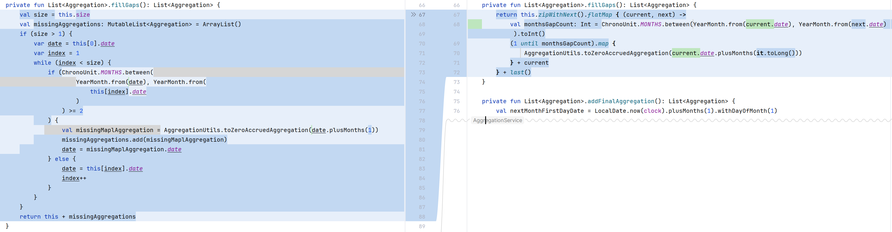
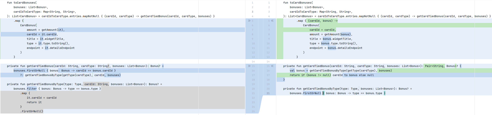
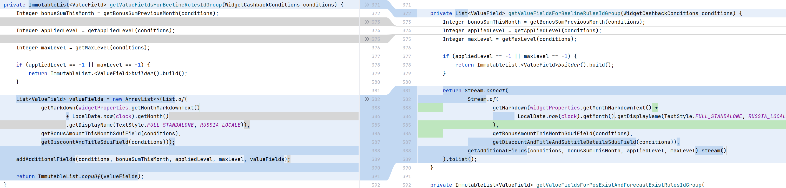

Хочется в целом отметить, что в коде очень часто можно избежать мутабельных состояний. Преимущества применения иммутабельного состояния вместо передачи сущностей по ссылке понятны. Иммутабельный экземпляр не может быть "неожиданно изменен" в ходе работы программы, что сокращает когнитивную нагрузку на разработчика, а значит и возможность ошибок. То же в целом относится и к прогнозируемым изменениям, особенно если мутабельными являются сразу несколько объектов в алгоритме. Таким образом получаем понятный и тестируемый по меркам человека код.

 В коде моих проектов преимущественно используются иммутабельные типы, а передача мутабельных типов по ссылке вообще большая редкость, которая появляется лишь по совершенной случайности. Возможно, такое подавляющее использование иммутабельности связано со спецификой разрабатываемых сервисов: обработка запросов.

Однако, мутабельное состояние еще можно встретить в моих старых алгоритмах.

Вот пример одного из них. Цель метода состоит в том, чтобы преобразовать входной список, выявив пробелы в последовательности дат и заполнив эти пробелы экземплярами начислений с нулевым начислением. Удивительно, как сильно получилось улучшить читаемость:



Однако, вернемся к "переходу к иммутабельности", который "должен ощутимо помогать в упрощении кода и уменьшении зависимостей".

**Пример 1.** 

В какой-то момент в класс Бонуса было для удобства (как это обычно и бывает) сопоставления с картой пользователя введено поле cardId. Поле cardId: 
1) с точки зрения модели не имело никакого отношения к бонусу
2) было мутабельным по причине невозможности его проставить при получении из бэк-системы: поле проставлялось в результате постобработки ответов других сервисов

Поле вполне логично было убрать из модели бонуса:


В результате рефакторинга избавляемся от мутабельного состояния и справляем искажение в исходной модели:



**Пример 2.**

Вместо передачи коллекции в метод addAdditionalFields (использование Additional вызывает вопросы), который добавляет элементы в переданную коллекцию, можно объединить две коллекции на уровне исследуемого метода.



**Пример 3.**

Данный пример является синтетическим и взят не из реального проекта, но кажется очень показательным.

Использование иммутабельности вместо передачи по ссылке хорошо ложится в логику системы контроля версий, где каждая модификация документа создаёт новую его версию. Использование метода copy позволяет сделать формирование очередной версии документа понятным, а процесс выстраивания истории изменений -- надёжным:

```kotlin
data class Document(val id: String, val content: String, val version: Int)

fun editDocument(original: Document, newContent: String): Document {
    return original.copy(content = newContent, version = original.version + 1)
}
```

**Вывод**

Вероятно, приведенные примеры не в полной мере демонстрируют преимущества "перехода к иммутабельности", который "должен ощутимо помогать в упрощении кода и уменьшении зависимостей". Однако, в каждом из них есть своя интересная идея, которую можно применить в будущем.