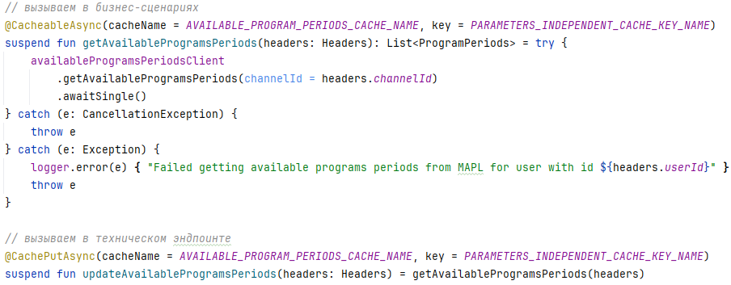

**1. Зависимость фреймворка**

Для end-to-end и unit-тестирования Java-приложений иногда поднимают in-memory БД, например H2. Зависит ли корректность кода приложения от драйвера H2? Да, зависит, так как поведение драйвера H2 может не совпадать с поведением драйвера, используемого для работы с БД в проде.

Как можно решить эту проблему? Использовать тот же драйвер для тестов, что и в проде, но поднимать при локальном тестировании не in-memory БД, а целевую БД нужной версии с помощью testcontainers.

Мы все равно продолжаем зависеть от корректности драйвера, но уже одного.

**2. Зависимость расшаренного формата**

У меня есть кэш. Кэш состоит из одной записи, которую используют все приложения (справочник). Бизнес-приложения, которые работают с этим справочником, не должны при обращениях обновлять его, так как справочник должен обновляться периодически с заданным интервалом и быть всегда доступным в кэше (не протухает). Для этого разработана джоба, которая запускается независимо от бизнес-приложений.

Справочник имеет свою структуру. Если структура справочника в джобе будет отличаться от структуры справочника в бизнес-приложении, то бизнес-приложения не смогут корректно функционировать. Как решить эту зависимость?

В бизнес-приложение добавляем эндпоинт, который будет отвечать за обновление кэша. Эндпоинт должен переиспользовать логику получения данных из кэша. Выглядит это следующим образом:

Таким образом мы избавляемся от необходимости синхронизировать модели справочника в двух местах.

Теперь зависимость расшаренного формата перешла в Зависимость фреймворка. Корректность справочника в кэше зависит от доступности и работоспособности эндпоинта бизнес-приложения, однако поддержка такой зависимости обходится значительно дешевле: справочник всегда будет в кэше, а за корректной периодичностью отрабатывания джобы будет ответственен алертинг.  

**3-4. Зависимость зависимости и Зависимость краша**

В Java есть пул потоков, который шарится на все приложение (ForkJoinPool). Он может быть неявно использован, например в стримах при помощи вызова на нем .parallel(). Любой разработчик может "добавить" к себе эту зависимость, не задумываясь, используется ли она в других участках кода. Так как пул потоков ограничен, то увеличившаяся нагрузка на него может привести к локальному снижению производительности.

Для того чтобы избежать подобного развития сценария, я стараюсь работать с некоторыми разделяемыми ресурсами явно, особенно если есть большой риск пострадать от действий другого разработчика.

В худшем случае неправильное использование пула потоков может привести к тому, что очередь задач будет расти, что приведет к OOM.

**5. Зависимость перебрасывания**

Многие наши приложения используют кэш. Должна ли от кэша зависеть корректность работы приложения? В идеале -- нет. Функциональное сопровождение сформировало такую суперспецификацию: приложение должно корректно стартовать и работать при недоступном кластере кэширования.

Понятно, что при недоступности кэша нагрузка, генерируемая приложением на сторонние сервисы, увеличится, но функциональность самого сервиса при этом не должна страдать.

Для того чтобы удовлетворить это требование, библиотека работы с кэшем была соответствующим образом модифицирована.

Ранее, если коровые сервисы, на которые завязаны практически все части системы, не могли достучаться до кэша, то проблемы начинал испытывать весь кластер. Почему так происходило? Запрос клиента при долгом ожидании ответа отваливался по таймауту, а вся полезная работа вытеснялась ожиданием ответа от корового сервиса.

Однако, нагрузку без кэша могут выдержать не все сервисы. В случае проблем с кластером кэширования количество входов в приложение пользователей ограничивается.

**6. Зависимость инверсии**

В программе может использоваться небезопасное приведение типов, которое подсвечивается статическим анализатором. Если в результате рефакторинга не получаем предупреждение от статического анализатора, то считаем проблему зависимостей на этом уровне решенной.

**7. Зависимость зацикливания**

В Spring самый простой пример циклической зависимости -- это когда бин A зависит от бина B, а бин B — от бина A. Наличие такой зависимости решается использованием аннотации @Lazy или (лучше) реорганизацией зависимостей в приложении. 

**8. Зависимость высшего порядка**

Другой пример зависимости высшего порядка в Java связан с использованием интерфейса Comparable и метода compareTo. Этот механизм используется в стандартных библиотеках, например, для сортировки элементов коллекций.

**9. Зависимость большинства**

Вероятно, можно привести пример потери данных при использовании алгоритма Raft. Когда данные реплицированы большинством нод, то продюсер может получить сообщение о том, что запись зафиксирована в системе. Если в следующий момент произойдет падение этих нод, то данные будут потеряны.

Как решать проблему? При наличии ресурсов можно увеличивать число нод, которые составляют кворум. Вероятность падения большего числа нод сокращается.

**Вывод**

Возможно, мои примеры по некоторым пунктам были не совсем точны. Не всегда просто определить с какого рода зависимостью имеем дело. Почему так? Зависимости не живут в вакууме, взаимодействуя с системой или являясь ее частью, они влияют на различные ее свойства. Таким образом мы получаем зависимость или частичную зависимость сразу нескольких свойств. В дополнение к этому необходимо оценивать влияние транзитивности зависимостей, так как не все кейсы могут трактоваться однозначно.

Как показали эти примеры мной не раз предпринимались попытки управления зависимости. Чаще всего они сводились к тому, что более проблемная зависимость заменялась на более простую в поддержке. Также наиболее распространенный вариант -- это принять издержки внедрения зависимости, если от нее больше пользы, чем проблем)

