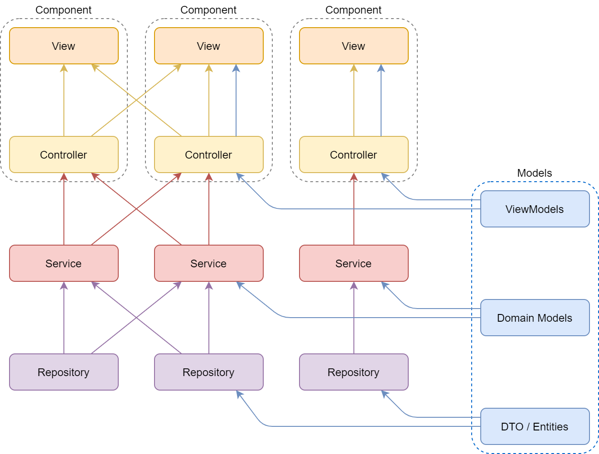
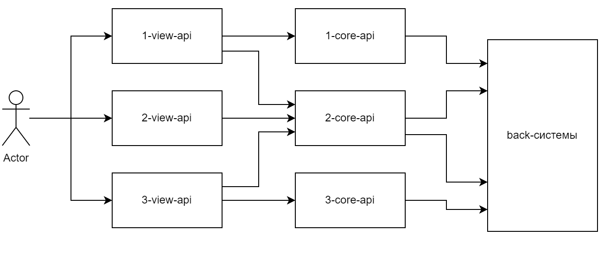

Если взять любой мой микросервис, то он будет построен в соответствии с многослойной архитектурой. Это классические для web-приложения на Spring слои: Controller, Service, Repository. Большинство разработчиков на Spring научились делить приложение на слои, обращаться только к нижележащим слоям (но не всегда непосредственно к одному нижележащему) и узлам того же слоя без создания циклических зависимостей. В борьбе с циклическими зависимостями помогает сам фреймворк, выбрасывая логичное исключение: BeanCurrentlyInCreationException. Однако некоторые интервьюеры все же захотят узнать у вас, как обойти это ограничение (конечно, без помощи рефакторинга :). Такие извращенные способы можно найти, например, здесь: https://www.baeldung.com/circular-dependencies-in-spring.

Для того чтобы показать слои приложения наглядно, я пошел искать картинку в интернетах. Эта показалась мне достаточно занятной: 

Картинка взята из статьи, которая рассказывает, в том числе о веб-фреймворках, но предлагаю переложить ее на рассматриваемые MVC-приложения. Для этого попрошу вас:
* узел, на который смотрит конец каждой стрелки, рассматривать как пользователя некоторой функциональности узла из нижележащего слоя
* не обращать внимания на подписи Component
* рассматривать Controller как API-слой сервиса, который предоставляет доступ к некоторому домену, а View — как слой, отвечающий за формирование ответов для отображения экранов на фронтах (смесью домена и UI)

Что еще хочется сделать с картинкой? Объединить все Repository в один слой, Service — в другой и т.д. Если картинка настолько неточна, то почему мы взяли ее для рассмотрения? (Здесь как раз будет полезно наше последнее действие по явному выделению слоев.) Мне хочется остановиться на объединении пунктиром слоев View и Controller, так как до недавнего времени эти слои у нас в сервисах были сцеплены воедино (в слой Controller). Каким образом это выражалось? В микросервисе могли быть перемешаны эндпоинты, которые отвечают за UI и за работу с доменом. Или хуже, когда один и тот же эндпоинт в системе использовался для обеих этих целей. И хотя циклических зависимостей здесь нет, но объединение слоев View и Controller привело к тому, что каша получилась не только на уровне этого объединенного слоя, но и на уровне Service, который стал по факту объединением уже известного нам Service и некоторой примеси Service View, которая представляет собой UI надстройку над доменом. 

Получилось так, что архитектура микросервиса повлияла на архитектуру системы. Каждый микросервис брал на себя слишком много, отчего очень легко могли образовываться циклические зависимости: как такового деления по слоям и не было. Для описания происходящего вполне подходит такая картинка:

Требовалось выработать новый подход, чтобы наш BFF был поддерживаемым. К какой модели мы пришли (это было буквально неделю назад)?

**view-api** — это API, отвечающая за агрегацию доменных данных и вывод необходимой информации на экран клиенту. Требования к view-api предъявляются следующие:

* все ручки view-api доступны только с фронтов, т.е. вызывать их из других API нельзя
* данные для отображения на экране, которые не приходят из core-api, должны прописываться в конфигурации view-api (текст, цвета кнопок, фона и др.)
* из view-api нельзя обращаться напрямую в back-системы

**core-api** — API, отвечающая за получение и обработку доменных данных с возможностью переиспользования. Требования к core-api предъявляются следующие:

* все ручки core-api недоступны с фронтов, т.е. содержат префикс /internal
* core-api ничего не знают про данные для отображения на экране (текст, цвета кнопок и фона), только если не проксируют эти данные с back-системы
* в идеале (что на практике будет сложно осуществимо) обращений между core-api тоже не должно быть

## Вывод

Исходно в системе имела место ошибка проектирования, при которой произошло перемешивание слоев. По этой причине сложно было даже проследить за зависимостями конкретных "микросервисов", а о повторном их использовании даже речи не шло. Исходную архитектуру системы нельзя было представить в виде направленного ациклического графа и тем более назвать ее строгой МУРА. 

По результатам анализа системы мы пришли к строгой МУРА не только на уровне одного сервиса, но и на уровне взаимодействия сервисов в кластере. Теперь каждый сервис отвечает либо за работу с доменом, либо за UI. Мы развязали эти независимые модули/слои, которые ранее были скреплены, чтобы добиться лучшего повторного использования (особенно доменных сервисов). За счет чего достигается строгость? Фронты теперь могут обращаться только к view-api, view-api — только к core-api, а core-api — только к back-системам.