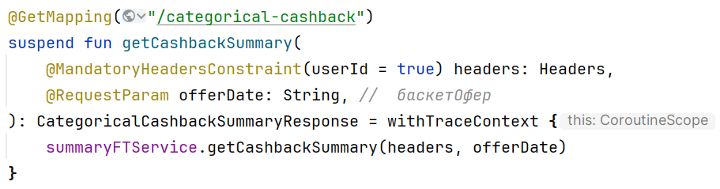
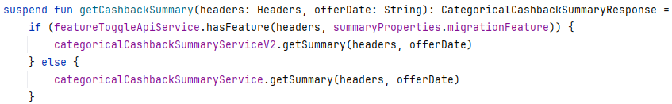
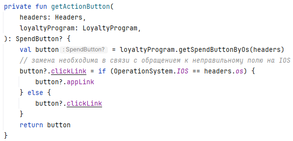
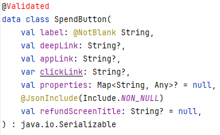
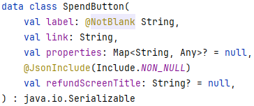

## Пример №1

Вы спросите, откуда у параметра offerDate взялся комментарий, который по виду никак не связан с датой?



Раньше получение информации о категорийном кэшбэке осуществлялось по переданной дате (о чем говорит название параметра offerDate), а сейчас -- по basketOfferId (некоторый идентификатор). Сейчас происходит процесс миграции со старого на новый процесс, когда новая функциональность раскрывается постепенно на новых пользователей. Коллеги, чтобы не переименовывать параметр и не создавать новый, решили, что все клиенты продолжат отсылать дату или идентификатор в старом параметре offerDate.

Как под капотом выглядит вызов getCashbackSummary?



В зависимости того, открыта ли функциональность на пользователя, выполняем вызов того или иного метода. Самое интересное в том, что такая проверка ничего не гарантирует, так как есть старые нативные мобильные клиенты, которые ничего не знают о существовании basketOfferId. Они продолжат присылать offerDate даже после того, как функциональность на них будет открыта. В итоге эта проверка должна быть изменена на regexp.

Можно ли было избежать такой проверки, требующей вызова стороннего сервиса? ДА! Просто требовалось добавить новый параметр в эндпоинт.

```kotlin
    @GetMapping("/categorical-cashback")
    suspend fun getCashbackSummary(
        @MandatoryHeadersConstraint(userId = true) headers: Headers,
        @RequestParam offerDate: String?,
        @RequestParam basketOfferId: String?,
    )
```

В этом случае мы разделяем ответственность за значения на два параметра. В этом случае проверять корректность содержимого от нас уже не требуется. После того как функциональность будет раскрыта на всех, мы удалим параметр offerDate, а basketOfferId сделаем NonNullable.

```kotlin
    @GetMapping("/categorical-cashback")
    suspend fun getCashbackSummary(
        @MandatoryHeadersConstraint(userId = true) headers: Headers,
        @RequestParam basketOfferId: String,
    )
```

## Пример №2

Есть метод:



При проектировании класса кнопки мной была допущена ошибка. Ссылки для разных платформ я определил в разные поля deepLink, appLink и clickLink:



Это, во-первых, делает все три поля nullable, а во-вторых, создает путаницу, какое из полей требуется заполнить, а какое -- нет (отсюда и появившиеся строчки кода с комментарием). Нужно было ограничиться одним полем link, которое заполнялось бы в зависимости от платформы клиента:



Такой вариант становится гораздо более поддерживаемым как с точки зрения аналитики, так и с точки зрения кода. Но, к сожалению, такую проблему не решить без нарушения обратной совместимости.

## Пример №3

Корутины в Kotlin могут возвращать CancellationException в случае, если выполнение корутины отменено. Это может произойти, например, при прерывании загрузки экрана пользователем. Если такое исключение логировать, то это приведет к фону ошибок в логах сервиса:

```kotlin
    suspend fun getBonusAccountsSummaries(headers: Headers): List<BonusAccountSummaryItem> = try {
        loyaltyApiReactorClient.getBonusAccountsSummaries(FeignHeaders.of(headers)).awaitSingle().accounts
    } catch (e: Exception) {
        logger.error(e) { "Error occurred while getting bonus accounts summary" }
        emptyList()
    }
```

Сами по себе эти ошибки будут только засорять лог, так как не сигнализируют о существовании проблемы. Такие ошибки требуется игнорировать так:

```kotlin
suspend fun getBonusAccountsSummaries(headers: Headers): List<BonusAccountSummaryItem> = try {
    loyaltyApiReactorClient.getBonusAccountsSummaries(FeignHeaders.of(headers)).awaitSingle().accounts
} catch (e: CancellationException) {
    throw e
} catch (e: Exception) {
    logger.error(e) { "Error occurred while getting bonus accounts summary" }
    emptyList()
}
```

или более компактно:

```kotlin
suspend fun getBonusAccountsSummaries(headers: Headers): List<BonusAccountSummaryItem> = runCatchingCancellable {
    loyaltyApiReactorClient.getBonusAccountsSummaries(FeignHeaders.of(headers)).awaitSingle().accounts
}.onFailure {
    logger.error(it) { "Error occurred while getting bonus accounts summary" }
}.getOrDefault(emptyList())
```

где runCatchingCancellable -- это:

```kotlin
inline fun <R> runCatchingCancellable(block: () -> R): Result<R> {
    return try {
        Result.success(block())
    } catch (e: Throwable) {
        if (e is CancellationException) {
            throw e
        } else {
            Result.failure(e)
        }
    }
}
```

К сожалению, наше коммьюнити не нашло другого решения, и правильная обработка ошибок лежит на разработчике каждый раз, когда он хочет воспользоваться конструкцией try-catch.


## Вывод

Для меня термин "раздутость" в контексте задания был, действительно, сбивающим с толку. Если взять исходное определение:

> Раздутость -- это когда в системе копится множество конкурирующих "фич", и вы не можете работать над одной конкретной функциональностью, если не будете при этом дополнительно заботиться о куче других "фич", казалось бы, никак с ней не связанных.

и важное уточнение в постановке:

> инвариант, который всегда создаёт дополнительную нагрузку на код: его надо соблюдать на память во множестве мест в коде

то я бы сказал, что лучше подойдет термин "перегруженность", когда возрастает когнитивная нагрузка на разработчика. Чем перегружен разработчик? Необходимостью управления инвариантами. Эта перегруженнность может отражаться в сложности чтения, понимания, документирования, рефакторинга и тестирования программы. Конечно, повышается сложность масштабирования и увеличивается время разработки. Инварианты часто ведут к высокой связанности кода, когда различные компоненты системы слишком сильно зависят друг от друга. Это затрудняет их переиспользование.

 Заставляя программиста отвлекаться на не связанные с текущей задачей логику/фичи, мы расфокусируем его внимание и гарантированно провоцируем на ошибки. Мы как будто делаем из разработчика менеджера, который должен за всем уследить и решать возникающие в коллективе конфликты.