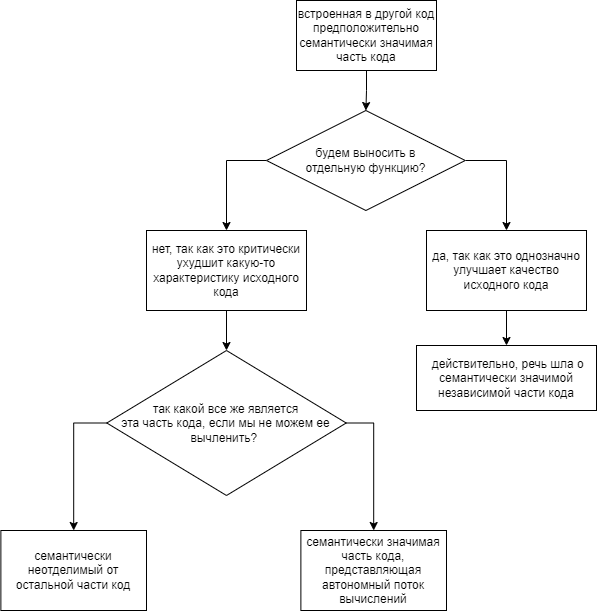

При поиске искомых участков кода я столкнулся со значительными трудностями. Почему? Круг подходящих под критерии поиска примеров оказался очень узок:



Как и было сказано в статье, это автономные потоки вычислений, так как они многократно пронизывают друг друга в процессе прохождения по функции. К сожалению, или к счастью, в моем коде таких примеров нет, но на ум сразу приходят проекты, в которых используются библиотеки с низким уровнем абстракции. В данном случае, например, пользовательский поток переплетается с техническим, необходимым для управления работой клиента https://github.com/adelaidekangaroo/Talk/blob/master/Client.java#L109. Этот код можно было бы оформить в виде конечного автомата, однако такое решение кажется здесь избыточным.

Что еще можно привести в качестве примеров? Например, использование сквозной функциональности: 

* поэтапные логирование и аудит;
* замеры производительности отдельных участков кода и сбор метрик;
* и т.д. 

Вот, например, поток аудита переплетается с бизнес-функциональностью подтверждения оффера. Каждое событие аудита одновременно сопровождается логированием. Прохождение этапов аудита уже оформлено в функции. Этот код можно было бы также оформить в виде конечного автомата, однако такое решение кажется здесь избыточным из-за малого числа состояний.

```kotlin
suspend fun confirmOffer(headers: Headers, offerConfirmationRequest: OfferConfirmationRequest) {
    ...
    try {
        auditService.updateOfferConfirmationAuditOperationStatus(headers, auditReference, OperationStatus.PROGRESS)
        wheelOfFortuneProviderService.confirmOffer(
            headers = headers,
            offerConfirmationRequest = offerConfirmationRequest
        )
        auditService.updateOfferConfirmationAuditOperationStatus(headers, auditReference, OperationStatus.SUCCESS)
        ...
    } catch (e: Exception) {
        ...
        auditService.updateOfferConfirmationAuditOperationStatus(headers, auditReference, OperationStatus.FAIL)
        ...
    }
}
```

А что еще? Остальные семантически значимые участки достаточно легко вычленяются в отдельные функции (распутываем лапшу). А если все же не вычленяются? Кажется, что в таком случае это проблема плохо написанного запутанного метода, в таком случае все что угодно можно сделать неотделимым.
