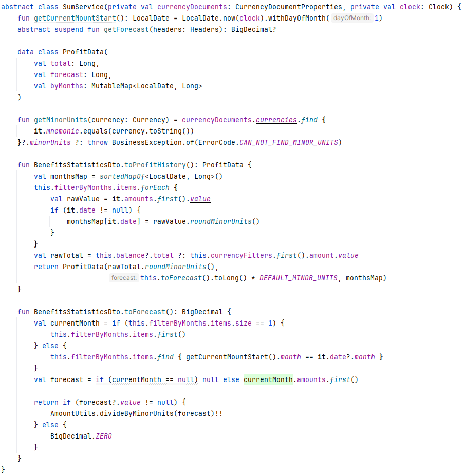
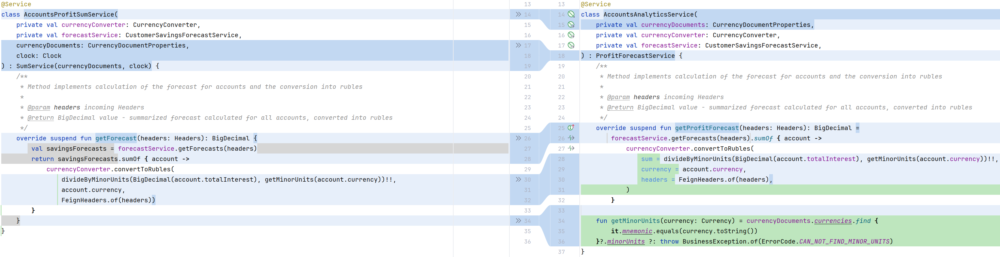
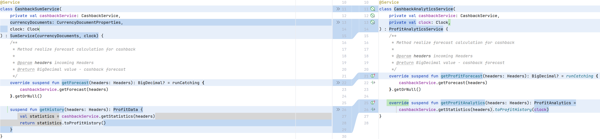
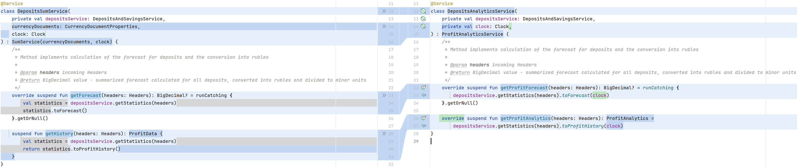
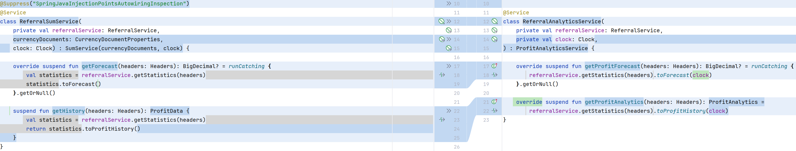
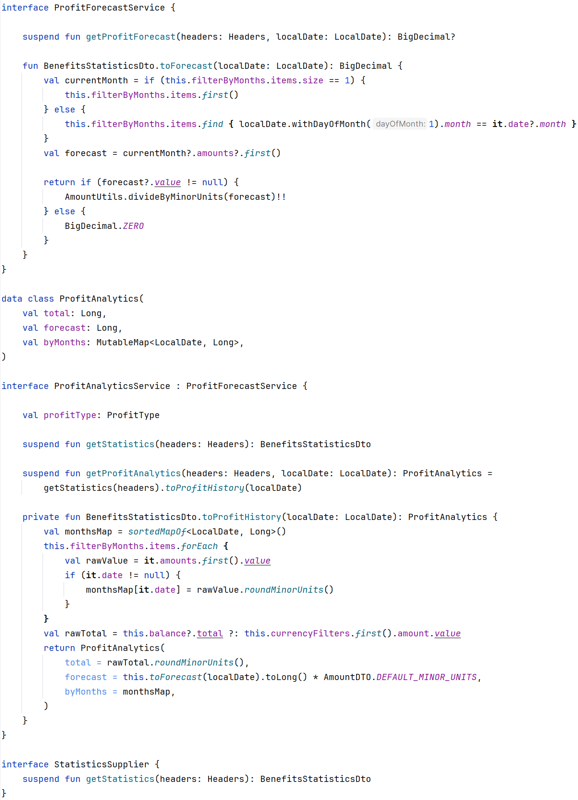
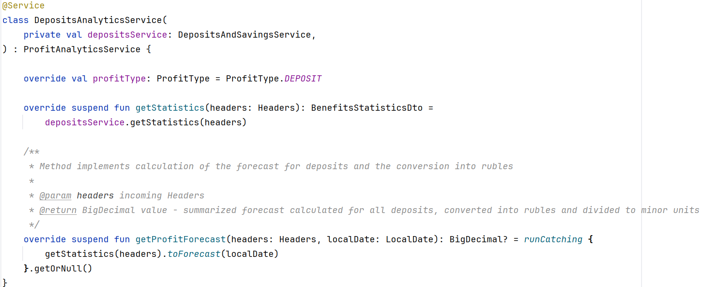
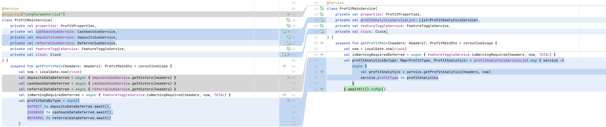
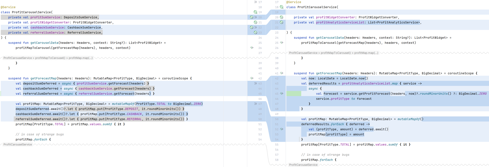

### Задание 2, пример 1

В Java даже подходящее под условия задачи предупреждение имеется:

```kotlin
@Suppress("UnnecessaryAbstractClass")
abstract class AbstractAwgwService {

    protected fun prepareFieldsForAwgw(
        fields: List<Field>,
        fieldsProperties: List<AnywayFieldProperty>
    ) = fieldsProperties.map { paymentFieldProperty ->
        InputField(paymentFieldProperty.targetField,
            paymentFieldProperty.value
                ?: (fields.firstOrNull { it.name == paymentFieldProperty.sourceField }
                    ?: throw InternalException.builder()
                        .message("There is no field ${paymentFieldProperty.sourceField}").build())
                    .defaultValue
        )
    }.toList()
}
```

В абстрактном классе нет состояния, но есть только один метод с реализацией. Ничего не мешает перевести этот абстрактный класс к интерфейсу с default-методом, зафиксировав тем самым общность поведения, избавившись от иерархии наследования.

### Задание 2, пример 2

Я обратил внимание на абстрактный класс:



Мне интуитивно показалось, что этот класс можно перевести в интерфейс. Почему? Сыграла совокупность факторов:
* всего один абстрактный метод
* достаточно слабые зависимости в виде CurrencyDocumentProperties (доступ к настройкам из конфиг-файла) Clock (для того, чтобы в тестах можно было удобно мокать время)
*  публичный getCurrentMountStart (имелось в виду Month), который нигде больше не используется
* метод getMinorUnits используется только в одном из наследников
* класс ProfitData и методы расширения скорее сгруппированы в объемлющий класс, чем должны быть частью иерархии

Я принял решение перейти от абстрактного класса SumService к интерфейсу:

```kotlin
interface ProfitForecastService {
    suspend fun getProfitForecast(headers: Headers): BigDecimal?
}
```

Казалось, что дело в шляпе -- избавились от ненужного абстрактного класса, но в процессе рефакторинга я понял, что в 3-х из 4-х наследниках присутствует еще и метод:

```kotlin
suspend fun getHistory(headers: Headers): ProfitData
```

"Отлично! Нам как раз нужно было найти автономные интерфейсы.", -- подумал я. Изучив сигнатуру, я увидел, что ProfitData (его мы видели на первом скрине) содержит также информацию о прогнозе выгоды (получаем из getProfitForecast(...)), но название метода getHistory и имя возвращаемого значения ProfitData сбивают с толку.

Я привел все методы getHistory в наследниках к виду:

```kotlin
suspend fun getProfitAnalytics(headers: Headers): ProfitAnalytics
```

что, связало getProfitForecast и getProfitAnalytics (бывший getHistory) логически. Может быть рефакторинг с приведением к интерфейсу неверен? Здесь уже напрашивается идея рассмотреть необходимость введения иерархии классов, но не будем спешить.

На этом этапе я выделил еще один интерфейс, который является наследником ProfitForecastService:

```kotlin
interface ProfitAnalyticsService : ProfitForecastService {
    suspend fun getProfitAnalytics(headers: Headers): ProfitAnalytics
}
```

Ок, интерфейсы выделили. Посмотрим, к каким изменениям это привело в наследниках класса SumService.

В AccountsAnalyticsService:
* стал имплементировать более узкий (по сравнению с абстрактным классом) интерфейс ProfitForecastService
* метод getMinorUnits и зависимость CurrencyDocuments переехали из SumService в единственный класс иерархии, откуда они вызывались




В CashbackAnalyticsService:
* начал имплементировать более широкий интерфейс ProfitAnalyticsService (добавился override для getProfitAnalytics, в прошлом getHistory) 
* ушла лишняя зависимость CurrencyDocuments



Аналогичные изменения произошли в DepositsAnalyticsService и ReferralAnalyticsService :





Тут мы натыкаемся еще на одно сходство. Получение аналитики в getProfitAnalytics происходит на основе некой статистики. Да, каждый раз сервис, отдающий статистику -- разный, но сигнатура совпадает. Отметим также, что Clock в зависимостях -- чисто техническая история для удобства мокирования -> от нее можно избавиться в пользу передачи дат.

В итоге получил набор таких интерфейсов:



А вот как теперь выглядит класс DepositsAnalyticsService (остальные по аналогии):



Видно, что рефакторинг пошел классам на пользу (однако над прасположением методами расширения надо бы еще подумать). Что касается самих интерфейсов -- они сейчас представляют собой не что иное, как абстрактные классы: здесь и состояние (profitType) и методы с реализацией и методы-расширения, которые не переопределить в наследниках. Конечно, речи об "автономных интерфейсах, которые могут реализовываться самыми разными "автономными" классами, или классами из разных иерархий" уже не идет.

В итоге имеем ситуацию, когда можно было бы на первый взгляд избавиться от абстрактного класса, остановившись только на использовании интерфейсов, но череда итераций рефакторинга привела нас к похожему на исходное, но правильному решению.

### Задание 3

Остался последний незакрытый вопрос: для чего на последнем скрине используется StatisticsSupplier ?

```kotlin
interface StatisticsSupplier {
    suspend fun getStatistics(headers: Headers): BenefitsStatisticsDto
}
```

Посмотрим на использование наших интерфейсов (по сути абстрактных классов):





Результат налицо. Динамическая диспетчеризация позволила избавиться в первом случае от:

```kotlin
@Suppress("LongParameterList")
```
и сделала оба решения более расширяемыми. Кроме того в обоих случаях была закрыта ошибка с получением независимого времени внутри каждого вызова getForecast/getProfitAnalytics вместо использования одного экземпляра LocalDate.

### Задание 4

Вероятно для избавления от иерархий может помочь функциональная инъекция зависимостей. Мы вроде бы и границы API задали и в то же время не планируем и не предполагаем использование более сильных инструментов, таких как наследование и интерфейсы. Чем расплачиваемся? Теперь обобщать разные классы нам не по чему, каждый класс с его границами сам по себе.

### Вывод

Примеры 1 и 2 показывают, что иерархии (в частности абстрактные классы) часто выделяется из наивных соображений: есть что-то общее -- вынесу это общее на уровень выше и унаследую поведение/состояние. Наследование в обоих случаях было использовано не по назначению.

В первом примере таким образом иерархия была создана ради иерархии, а во втором -- абстрактный класс стал хранилищем всего, что удобно в моменте было разместить рядом. В итоге видим непонятно для чего взявшийся здесь метод getMinorUnits. Этот пример показал, что выделение операций, является необходимым пререквизитом для формирования правильной иерархии наследования. Исходное решение имеет правильные предпосылки, но в то же время значительно отличается от финального.