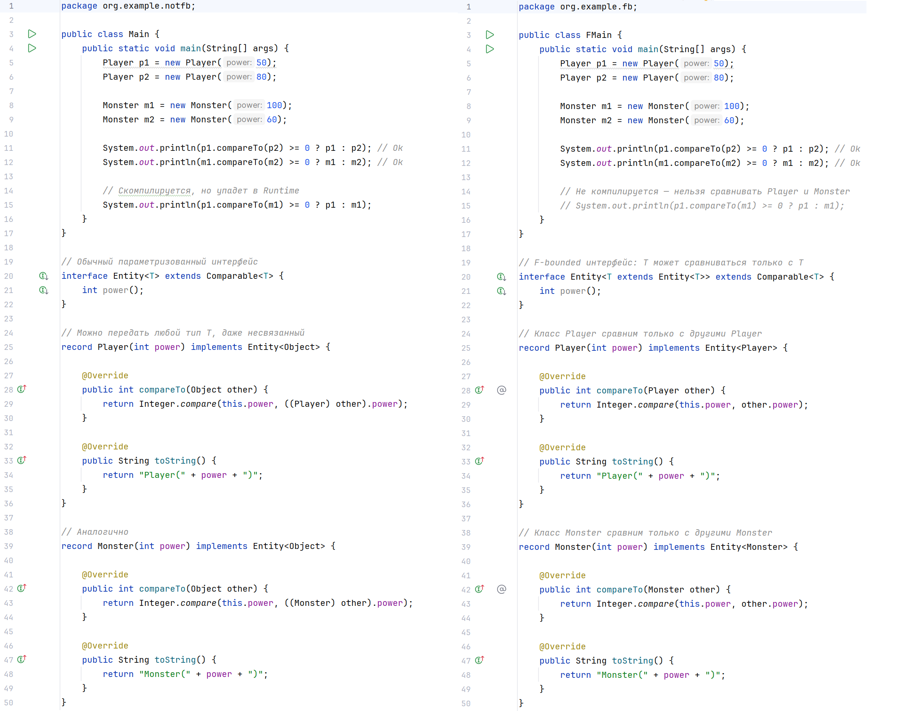

# F-bounded quantification / F-bounded polymorphism / recursively bounded quantification

В Java есть встроенная поддержка F-bounded polymorphism. Как это выглядит синтаксически? 

Если обратиться к примеру из https://en.wikipedia.org/wiki/Bounded_quantification, то видим, что у нас есть возможность использовать Comparable как в сыром / не параметризованном (`min`), так и в типобезопасном стилях (`fMin`):

```java
interface Comparable<T> {
    int compareTo(T other);
}

public class Test {
    public static void main(String[] args) {
        String a   = min("cat", "dog");
        Integer b  = min(10, 3);
        Object c   = min("cat", 3); // Throws ClassCastException at runtime
        String str = fMin("cat", "dog");
        Integer i  = fMin(10, 3);
     // Object o   = fMin("cat", 3); Does not compile
    }
    
    public static <S extends Comparable> S min(S a, S b) { // Raw use of parameterized class 'Comparable'
        if (a.compareTo(b) <= 0) { // Unchecked call to 'compareTo(T)' as a member of raw type 'java.lang.Comparable' 
            return a;
        } else {
            return b;
        }
    }
    
    public static <T extends Comparable<T>> T fMin(T a, T b) {
        if (a.compareTo(b) <= 0) {
            return a;
        } else {
            return b;
        }
    }
}
```

Наличие обоих вариантов обусловлено поддержкой обратной совместимости со старыми версиями: generic-типы появились в Java не сразу. `min` требует, чтобы передаваемые объекты были _сравниваемые_, а `fMin` -- _сравниваемые одного типа_, что достаточно легко считывается из сигнатур методов. Компилятор также выдаст предупреждение для `min` (`Raw use of parameterized class 'Comparable'`) и для `a.compareTo(b)` (`Unchecked call to 'compareTo(T)' as a member of raw type 'java.lang.Comparable'`), поэтому в коде такое решение встретить можно сравнительно редко.

Вариация на тему выше:



В случае F-bounded интерфейса задать таким образом класс `record Player(int power) implements Entity<Object>` уже не получится: `Type parameter 'java.lang.Object' is not within its bound; should implement 'Entity<java.lang.Object>'`

Перечисления в стандартной библиотеке реализованы, опираясь на F-bounded polymorphism:

```java
public abstract class Enum<E extends Enum<E>> implements Comparable<E>, ...
```

`E` должен быть тем, кто наследует `Enum`!

Соединим полученные знания при реализации собственного функционального интерфейса:

```java
interface Mergeable<T extends Mergeable<T>> { // типобезопасный вариант
    T merge(T other);
}

interface BadMergeable<T> { // НЕтипобезопасный вариант
    T merge(T other);
}

class Banana{}

class SmthStrange implements BadMergeable<Banana> { // пример НЕтипобезопасной реализации
    @Override
    public Banana merge(Banana other) {
        return new Banana();
    }
}

class Document implements Mergeable<Document> { // пример типобезопасной реализации
    private final String content;

    public Document(String content) {
        this.content = content;
    }

    @Override
    public Document merge(Document other) {
        return new Document(this.content + "\n" + other.content);
    }

    @Override
    public String toString() {
        return content;
    }
}

public class MergeableTest {
    public static void main(String[] args) {
        Document a = new Document("Hello");
        Document b = new Document("World");
        Document c = new Document("!");

        Document merged = mergeAll(List.of(a, b, c));
        System.out.println(merged);
    }

    public static <T extends Mergeable<T>> T mergeAll(List<T> items) {
        return items.stream().reduce(T::merge).orElseThrow();
    }
}
```

F-bounded polymorphism позволяет выражать важную идею, когда тип должен быть _совместим_ с самим собой (рекурсивно), а не просто с каким-то произвольным другим типом. Он защищает от логических ошибок на этапе компиляции, устраняя необходимость в дополнительных проверках в рантайме и приведении типов, что позволяет более точно выразить семантику. В примерах было видно, что составить странную конструкцию становится сложнее. Тем не менее при желании правила можно нарушить (`class OtherDocument implements Mergeable<Document>`), если специально не защищаться. Если говорить о самом синтаксисе, то он не является очевидным. То же можно сказать и об иерархии классов, объявления выглядят громоздко:

```java
class Base<T extends Base<T>> { ... }
class Derived<T extends Derived<T>> extends Base<T> { ... }
class Concrete<T extends Concrete<T>> extends Derived<T> { ... }
```

Как у любого другого подхода тут есть свои плюсы и минусы. Я бы рассмотрел альтернативы F-Bounded polymorphism, если задачу можно решить проще.