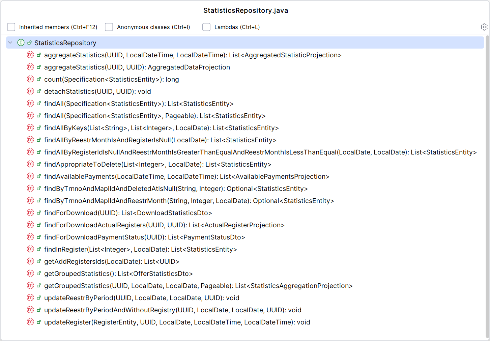
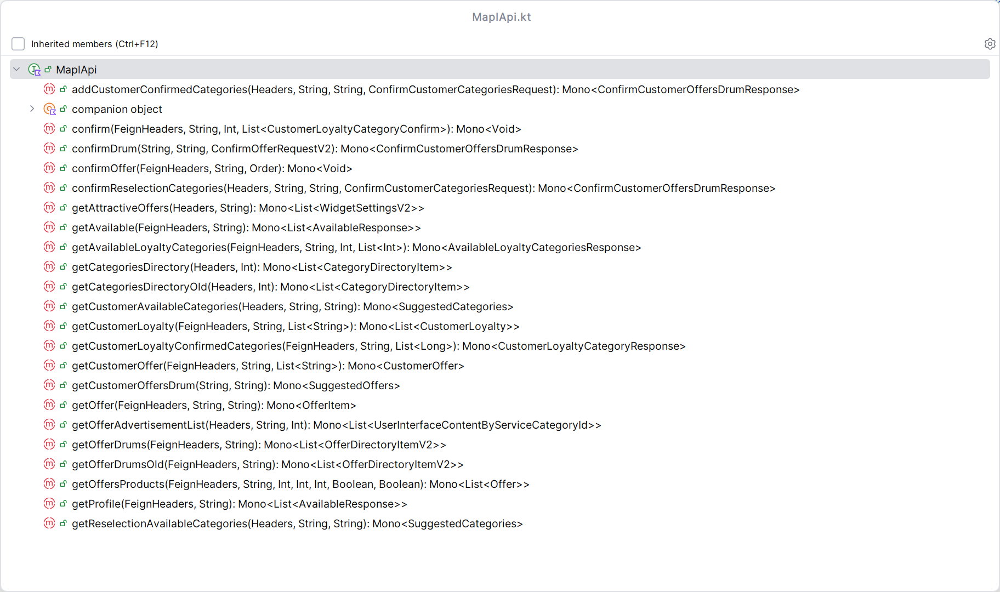
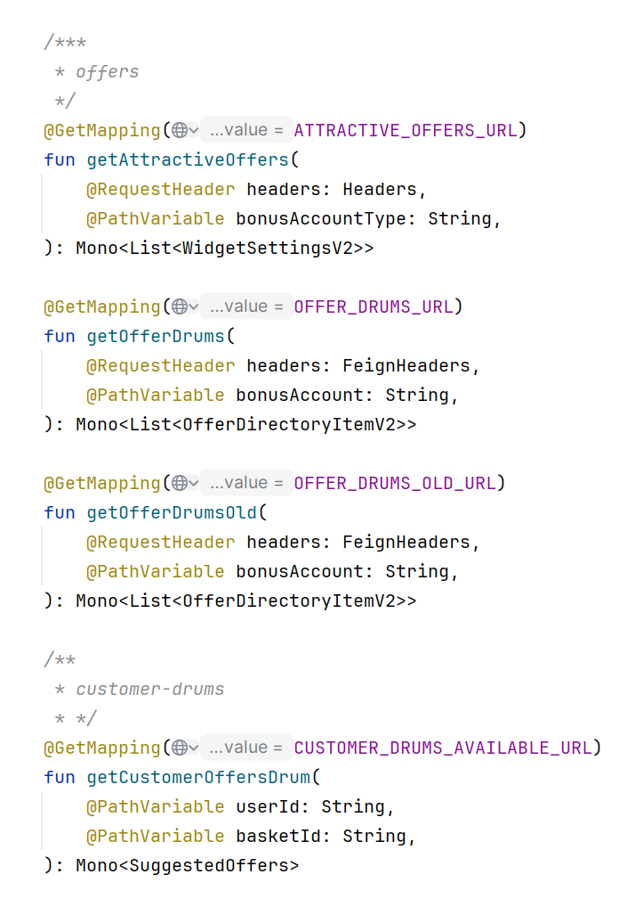

# Пример 1

Пример из кода коллег. Есть интерфейс репозитория:

```java
public interface StatisticsRepository extends JpaRepository<StatisticsEntity, UUID> { ...
```

Смотрим список его методов:



Вопиющий случай :)

По какому принципу все эти методы собраны в одном месте? Предполагаем:

**Причина № 1.** Возвращаемое значение связано с StatisticsEntity.

**Причина № 2.** Метод возвращает какую-то разновидность статистики.

**Причина № 3.** Метод findForDownloadPaymentStatus, видимо, просто добавлен по инерции, так как он не связан ни с таблицей статистики, ни с доменом статистики :).

Какими, предположительно, путями можно пойти при разделении интерфейса?

**Гипотеза № 1.** сгруппировать методы интерфейса по действию, например, чтение

**Гипотеза № 2.** сгруппировать методы интерфейса в соответствие с принадлежности к сервису, где сейчас используются методы

Рассмотрим первую гипотезу:

```java
public interface StatisticsReadRepository ... {
    
    List<StatisticsEntity> findAll(Specification<StatisticsEntity> specification, Pageable pageable);

    List<StatisticsEntity> findAll(Specification<StatisticsEntity> specification);

    long count(Specification<StatisticsEntity> specification);

    Optional<StatisticsEntity> findByTrnnoAndMaplIdAndReestrMonth(String trrno, Integer maplId, LocalDate reestrMonth);

    // Не используется в коде, видимо, оставлен на светлое будущее
    // Optional<StatisticsEntity> findByTrnnoAndMaplIdAndDeletedAtIsNull(String trrNo, Integer maplId);

    List<StatisticsEntity> findAllByKeys(List<String> transactionNumbers, List<Integer> maplIds, LocalDate month);
}
```

Получилось не очень. Почему? Сейчас разные методы чтения используются в разных сценариях. Методы выше используются в трех разных классах.

Рассмотрим вторую гипотезу. Соберем все методы, которые относятся к StatisticsService. Концептуально получается лучше, но подходящих методов более 10. Нужно рефакторить и класс и интерфейс.

# Пример 2

Рассмотрим интерфейс:

```kotlin
interface CategoriesRepository {

    suspend fun find(userId: String, basketOfferId: Long): Categories

    suspend fun delete(userId: String, basketOfferId: Long)
}
```

Разделим его на два:

```kotlin
interface FindCategoriesRepository {

    suspend fun find(userId: String, basketOfferId: Long): Categories
}

interface DeleteCategoriesRepository {

    suspend fun delete(userId: String, basketOfferId: Long)
}
```

С появляющимся в рамках рефакторинга на глазах большим числом интерфейсов напрашивается использование префикса I в имени интерфейса.

Теперь ICategoriesRepository будет вмещать в себя IFindCategoriesRepository и IDeleteCategoriesRepository:

```kotlin
interface ICategoriesRepository : IFindCategoriesRepository, IDeleteCategoriesRepository

@Service
class CategoriesRepository(
    ...
) : ICategoriesRepository {
```

Однако это не уберегает нас от затрагиваемой в статье проблемы, когда при тестировании методов других сервисов, в которые мы инжектируем CategoriesRepository, эти самые методы могут использовать либо только find, либо только delete:

```kotlin
@Service
class CategoriesService(
    private val categoriesRepository: ICategoriesRepository,
    ...
) {
    
    fun getCategories(...) : Categories {
        ...
        categoriesRepository.find(...)
        ... 
    }

    fun refreshCategories(...) : Categories {
        ...
        categoriesRepository.delete(...)
        ...
    }
}
```

Чтобы избежать избыточной работы, мы не хотим мокировать categoriesRepository.delete(...) для getCategories(...) и categoriesService.find(...) для refreshCategories(...). Можно было бы заинжектить CategoriesRepository два раз через разные интерфейсы, но это выглядит совсем избыточно. Какая есть альтернатива?

Библиотека mockk позволяет нам это сделать с помощью явных проверок числа вызовов, правда код теста становится не таким выразительным:

```kotlin
class CategoriesService {
    
    private val categoriesRepository: CategoriesRepository = mockk()
    private val availabilityService: AvailabilityService = mockk()
    ...

    private val categoriesSummaryService = CategoriesService(
        categoriesRepository,
        availabilityService,
        ...
    )

    @Test
    fun `успешное получение сводки по категориям`() {
        ...

        coEvery {
            categoriesRepository.find(...)
        } returns ...

        coEvery {
            availabilityService...
        } returns ...

        runBlocking {
            val actual = categoriesSummaryService.getSummary(...)
            Assertions.assertThat(actual).isEqualTo(expected)
            coVerify(exactly = 1) { categoriesService.find(...) }
            coVerify(exactly = 1) { availabilityService... }
        }
    }

    @Test
    fun `успешное обновление сводки по категориям`() {
        ...

        coEvery {
            categoriesService.delete(...)
        } returns ...
                
        runBlocking {
            val actual = categoriesSummaryService.refresh(...)
            Assertions.assertThat(actual).isEqualTo(expected)
            coVerify(exactly = 1) { categoriesService.delete(...) }
            coVerify { availabilityService wasNot Called }
        }
    }
}
```

coVerify:

* с аргументом exactly проверяет число вызовов замокированного метода

* может проверить отсутствие вызовов у моков, которые не участвовали в тестах (availabilityService wasNot Called)

В целом логику сбора информации для coVerify можно спрятать в обертки над coEvery, которые будут собирать метаинформацию об использовании моков. В конце теста на основе нее будем просто запускать процесс проверки.

Что-то типо:

```kotlin
abstract class MockkBaseTest {
    private val registeredMockks = mutableListOf<Any>()
    private val registeredCoEvery = mutableListOf<Any>()

    protected inline fun <reified T : Any> registeredMockk(): T = mockk<T>().also { registeredMockks += it }

    protected inline fun registeredCoEvery(stubBlock: suspend MockKMatcherScope.() -> T): MockKStubScope<T, T> = coEvery(stubBlock).also { registeredCoEvery += verify(exactly = 1, block = stubBlock) }

    @AfterEach
    fun assertNoUnexpectedCalls() {
        ...
    }
}
```

Можно ли, используя такой подход, сказать, что деление интерфейса на отдельные методы избыточно? Кажется, что да. В тесте мы начали контролировать, как используется наш интерфейс. Теперь мы можем перейти к решению основной проблемы, когда разные потребители используют интерфейс лишь частично.

# Пример 3

Посмотрим на интерфейс для обращения к REST API бэкенда:

```kotlin
@ReactiveFeignClient(
    name = "loyaltyBackendApi",
    url = "\${urls.loyalty_backend}",
    configuration = ...
)
@SuppressWarnings("TooManyFunctions")
interface LoyaltyBackendApi {
...
```

@SuppressWarnings("TooManyFunctions") тут уже как бы намекает, что что-то идет не так :). Посмотрим на список методов:



В коде мы можем найти такие комментарии для разбиения методов на группы:



Очевидно, что все методы были помещены в один интерфейс по причине использования одной и той же конфигурации в @ReactiveFeignClient, однако лучше разделить один большой интерфейс на специализированные.

# Пример 4

Смотрим на следующий пример:

```java
public interface CacheService {

    <T> Optional<T> get(String key, Class<T> clazz);

    <T> Optional<List<T>> getList(String key, Class<T> clazz);

    void save(String key, Object value, Class<?> type);

    void save(String key, Object value);

    void save(String key, Object value, Class<?> type, long seconds);

    void save(String key, Object value, long seconds);

    void remove(String key, Class<?> type);
}

public class RedisService implements CacheService {
    ...
}

public class TransactionJobHandler {
    private final RedisService redisService;
    ...

    // единственное использование сервиса
    private boolean isCancelled() {
        var isCancelled = withDefault(
                () -> redisService.get(PROCESS_NAME, AsyncJobStateCacheDto.class)
                        ...    
    }
}
```

Не совсем понятно, почему RedisService инжектится не через CacheService, но да ладно. ОЧевидно, что в этом случае весь интерфейс нам не нужен, достаточно только метода get:

```java
public interface GetCacheService {

    <T> Optional<T> get(String key, Class<T> clazz);
}

public class RedisService implements CacheService /* который в свою очередь расширяет GetCacheService */{
    ...
}

public class TransactionJobHandler {
    private final GetCacheService cacheService;
    ...

    private boolean isCancelled() {
        var isCancelled = withDefault(
                () -> cacheService.get(PROCESS_NAME, AsyncJobStateCacheDto.class)
                        ...    
    }
}
```

# Вывод

После выполнения задания я могу выделить для себя три уровня понимания ISP:

1) разрозненная с точки зрения домена логика должна находиться в разных интерфейсах;

2) нельзя бесконечно наращивать число методов интерфейса даже в рамках одного домена;

3) классы программы не должны зависеть от тех методов, которые они не используют, т.е. в интерфейс должны попадать методы, которые используются вместе и логически неотделимы.

Если честно, то я до выполнения задания был на втором уровне понимания. Пример 1 показывает, что при желании в интерфейс можно запихать все что угодно. Примеры 3 показывает, что близкие "по духу" методы, когда их много, все равно нуждаются в разделении. Пример 4 демонстрирует высший уровень понимания, когда мы снижаем число зависимостей нашего кода, используя минимально необходимые возможности, которые предоставляются нам через интерфейсы.