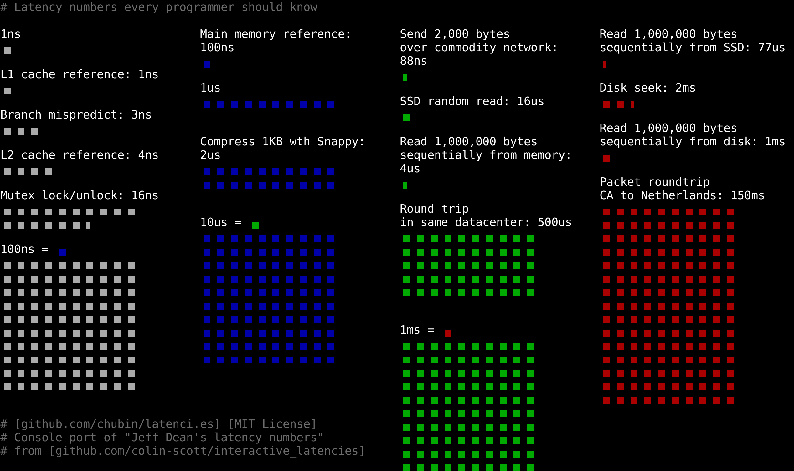

# Пример 1

Был давно на одном из собеседований, где чуть ли не сразу стало понятно, что долго оно не продлится. Почти в самом начале последовал вполне обычный вопрос про разницу ArrayList и LinkedList. То ли меня спросили, то ли я сам заикнулся про то, что ArrayList практически всегда нужно предпочесть LinkedList с точки зрения производительности.

Я сказал, что как раз смотрел видео Шипилёва на эту тему. Я рассказал про cache line, но, видимо, не очень убедительно и мы начали закапываться в архитектуру процессора и памяти.

Интерьвюер задал вопрос про разницу по времени доступа к памяти и кэшу. Я точно не помнил, но ответил, что на порядок по мотивам: 

Интервьюер начал гуглить) и был удивлен, что я дал правильный ответ. Но собеседование я, конечно, не прошел).

# Пример 2

Мне нравится вопрос про volatile. Зачем нужно ключевое volatile, если в современных CPU есть когерентность кэшей?

Тут как минимум стоить сказать, что volatile нужен еще и для ограничения переупорядочивание инструкций процессором, оптимизаций компилятора и JIT-компилятора. Но и, конечно, сбрасывать обновления из регистров и буфера процессора в кэш тоже нужно, чтобы кэш между ядрами был актуальным.

https://jenkov.com/tutorials/java-concurrency/cache-coherence-in-java-concurrency.html
https://strogiyotec.github.io/pages/posts/volatile.html

# Пример 3

Никто не знает правильной трактовки каждого из свойств CAP-теоремы. С ней, конечно, нужно знакомиться в оригинальной работе:

https://users.ece.cmu.edu/~adrian/731-sp04/readings/GL-cap.pdf

Приводил ее интерпретацию у себя в блоге:
https://t.me/senior_junior_developer/40
https://t.me/senior_junior_developer/41